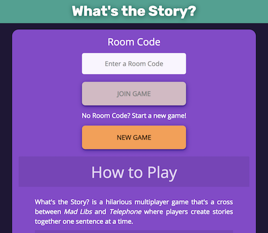
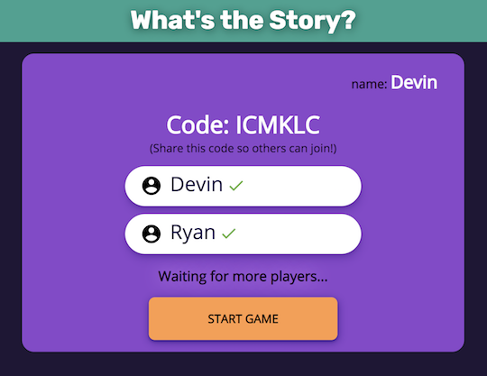
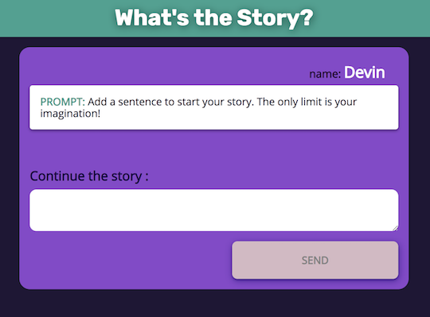
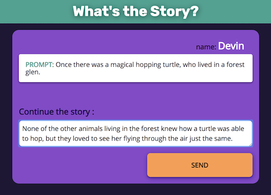
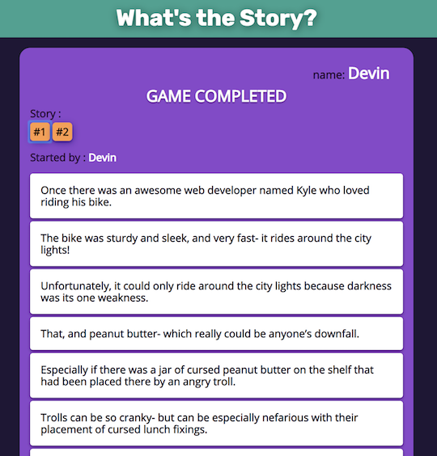
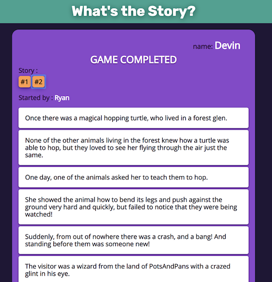

# What's the Story?

Find the [server repo here](https://github.com/thinkful-ei22/kyle-story-game-server).
Find the [client repo here](https://github.com/thinkful-ei22/kyle-story-game-client).<br>
You can [play the game here](https://whats-the-story.netlify.com/) with your friends or teammates.

## About

_What's the Story?_ is a hilarious multiplayer game that's best described as a cross between _Mad Libs_ and _Telephone_ where players create collaborative stories written one sentence at a time.

### The Twist

Each player can only see the latest sentence of the story!

### Gameplay

- From the Home screen, players can choose to either:
  - Start a new game where they will be given a randomly generated Room Code to share with other players.
  - Join an existing game by entering a Room Code generated by someone else.



- Once all players have joined, the Start Game button allows players to, well... Start the Game!



- After submitting an initial sentence, each story is passed to the next player.



- Play continues with each player adding a sentence to the story based on only the preceding sentence without further context.



- The game ends when each story reaches a predetermined length (measured in number of sentences).
- Players can then select and read all the stories created during the game.

 

### Winning

_What's the Story?_ is a collaborative game emphasizing creativity and originality. As such, there is no "winner", _per se_. Players win _together_ to the extent that they use their creativity to come up with interesting stories.

## Tech Stack

The tech stack for this project includes:

- `Node.js` server
- `Express` for route handling
- `MongoDB`/`Mongoose` for the persistence layer
- `Socket.IO` for real-time multiplayer communication with game clients
- `React` frontend with `Redux` for state management
- `Chance.js` for generating random names and Room Codes
- `Mocha/Chai` for backend testing
- `Enzyme/Jest` for frontend testing

## HTTP API

### POST "/"

Purpose: Create a new game session.

Example: POST <https://example.com/>

Request body:

```json
{
  "playerName": "Susan"
}
```

Response body:

```json
{
  "started": false,
  "completed": false,
  "roomCode": "ABCDEF",
  "players": [
    {
      "readyState": false,
      "inSession": true,
      "name": "Susan",
      "createdAt": "2018-11-02T22:28:55.386Z",
      "updatedAt": "2018-11-02T22:28:55.386Z",
      "id": "aaaaaaaaaaa1"
    }
  ],
  "stories": [],
  "id": "bbbbbbbbbbbb"
}
```

## Socket.io API [ client -> server ]

All other game interactions are performed over the socket.io connection as Redux style actions where the `action.type` of actions sent to the server begin with `SERVER_`.

The socket connection requires setting up custom middleware using [socket.io-client](https://www.npmjs.com/package/socket.io-client) from npm.

### SERVER_JOIN_ROOM

Purpose: Add a player to a channel corresponding to an existing game session.

```js
{
  type: 'SERVER_JOIN_ROOM',
  roomCode: 'ABCDEF'
}
```

### SERVER_JOIN_GAME

Purpose: Add a player to an existing game.

```js
{
  type: 'SERVER_JOIN_GAME',
  roomCode: 'ABCDEF',
  playerName: 'Mabelle'
}
```

### SERVER_START_GAME

Purpose: Start an existing game.

```js
{
  type: 'SERVER_START_GAME',
  roomCode: 'ABCDEF'
}
```

### SERVER_ADD_SENTENCE

Purpose: Add a player's sentence to the proper story inside the gameSession.

```js
{
  type: 'SERVER_ADD_SENTENCE',
  roomCode: 'ABCDEF',
  text: 'Sentence to add goes here.',
  author: 'Mabelle',
  storyId: 'cccccccccccc'
}
```

## Socket.io API [ server -> client ]

### JOIN_GAME_SUCCESS

Purpose: Send full gameSession data to newly joined players.

```js
{
  type: 'JOIN_GAME_SUCCESS',
  id: 'bbbbbbbbbbbb',
  roomCode: 'ABCDEF',
  players: [
    {
      readyState: false,
      inSession: true,
      name: 'Susan',
      createdAt: 2018-11-02T22:28:55.386Z,
      updatedAt: 2018-11-02T22:28:55.386Z,
      id: 'aaaaaaaaaaa1'
    },
    {
      readyState: false,
      inSession: true,
      name: 'Mabelle',
      createdAt: 2018-11-03T19:24:19.799Z,
      updatedAt: 2018-11-03T19:24:19.799Z,
      id: 'aaaaaaaaaaa2'
    },
  ],
  started: false,
  completed: false,
  stories: []
}
```

### UPDATE_PLAYERS

Purpose: Send only the updated players list to existing players when a new player joins the game.

```js
{
  type: 'UPDATE_PLAYERS',
  players: [
    {
      readyState: false,
      inSession: true,
      name: 'Susan',
      createdAt: 2018-11-02T22:28:55.386Z,
      updatedAt: 2018-11-02T22:28:55.386Z,
      id: 'aaaaaaaaaaa1'
    },
    {
      readyState: false,
      inSession: true,
      name: 'Mabelle',
      createdAt: 2018-11-03T19:24:19.799Z,
      updatedAt: 2018-11-03T19:24:19.799Z,
      id: 'aaaaaaaaaaa2'
    },
  ]
}
```

### JOIN_ROOM_ERROR

Purpose: Let a player know if an attempt to join a room was unsuccessful.

```js
{
  type: 'JOIN_ROOM_ERROR',
  error: 'Unable to join room'
}
```

### JOIN_GAME_ERROR

Purpose: Let a player know if an attempt to join a game was unsuccessful.

```js
{
  type: 'JOIN_GAME_ERROR',
  error: 'Unable to join game. Check your code and try again.'
}
```

### START_GAME_SUCCESS

Purpose: Let all players in the channel know that the game has started.

```js
{
  type: 'START_GAME_SUCCESS',
  gameSession: {
    started: true,
    completed: false,
    roomCode: 'ABCDEF',
    players: [
      {
        readyState: false,
        inSession: true,
        name: 'Susan',
        createdAt: 2018-11-02T22:28:55.386Z,
        updatedAt: 2018-11-03T20:17:23.713Z,
        passesTo: 'Mabelle',
        id: 'aaaaaaaaaaa1'
      },
      {
        readyState: false,
        inSession: true,
        name: 'Mabelle',
        createdAt: 2018-11-03T19:24:19.799Z,
        updatedAt: 2018-11-03T20:17:23.713Z,
        passesTo: 'Susan',
        id: 'aaaaaaaaaaa2'
      }
    ],
    stories: [
      {
        completed: false,
        completionLength: 10,
        creator: 'Susan',
        sentences: [],
        id: 'ccccccccccc1'
      },
      {
        completed: false,
        completionLength: 10,
        creator: 'Mabelle',
        sentences: [],
        id: 'ccccccccccc2'
      }
    ],
    id: 'bbbbbbbbbbbb'
  }
}
```

### START_GAME_ERROR

Purpose: Let a player know if an attempt to start a game was unsuccessful.

```js
{
  type: 'START_GAME_ERROR',
  error: 'Unable to start game.'
}
```

### ADD_INITIAL_PROMPT

Purpose: Send an initial prompt to each player to help them start their story.

```js
{
  type: 'ADD_INITIAL_PROMPT',
  receiver: 'Susan',
  storyId: 'ccccccccccc1',
  prompt: 'Add a sentence to start your story. The only limit is your imagination!'
}
```

### ADD_SENTENCE_SUCCESS

Purpose: Let all players know that a sentence was successfully added to a story, so they can update their local data with the new sentence.

```js
{
  type: 'ADD_SENTENCE_SUCCESS',
  text: 'Sample sentence added by Susan',
  author: 'Susan',
  id: 'ddddddddddd1',
  storyId: 'ccccccccccc1'
}
```

### ADD_SENTENCE_ERROR

Purpose: Let a player know that their attempt to add a sentence was unsuccessful.

```js
{
  type: 'ADD_SENTENCE_ERROR',
  error: 'Unable to add sentence. Weird.'
}
```

### ADD_UPCOMING_PROMPT

Purpose: Pass a newly added sentence as a prompt to the next player in the rotation for that story.

```js
{
  type: 'ADD_UPCOMING_PROMPT',
  storyId: 'ccccccccccc1',
  prompt: 'Sample sentence added by Susan',
  receiver: 'Mabelle'
}
```

### FINISH_GAME

Purpose: Let all players know that the game has been completed.

```js
{
  type: 'FINISH_GAME',
  completed: true
}
```
